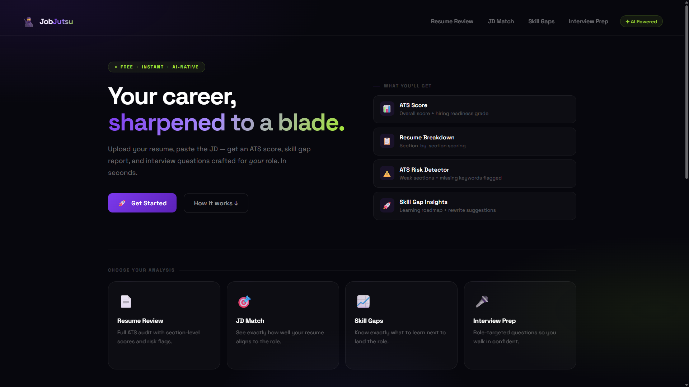
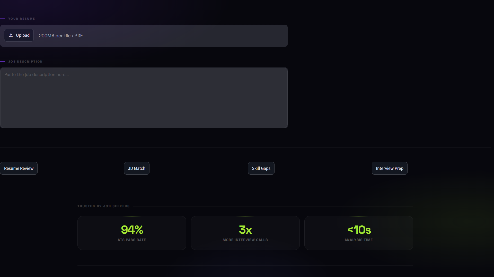
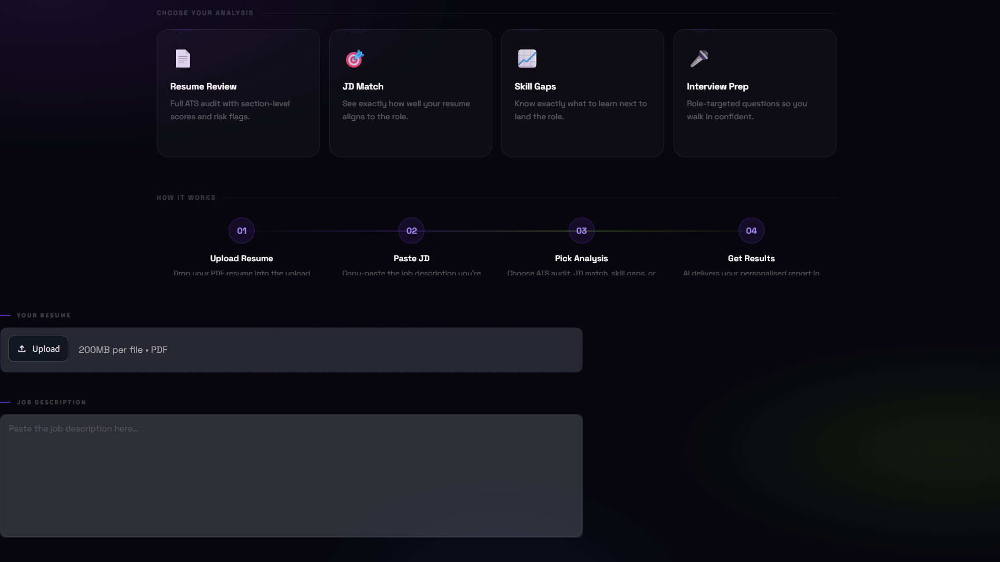

# 🥷 JobJutsu AI

AI-powered career copilot that helps job seekers analyze resumes, compare them against job descriptions, identify skill gaps, and generate personalized interview questions using LangGraph and Gemini 2.5 flash.

---

## 🚀 Features

### 📄 Resume Analysis

* Resume strengths and weaknesses
* ATS-style evaluation
* Improvement suggestions
* Career recommendations

### 🎯 Resume vs JD Matching

* Compare resume against a target job description
* Match score generation
* Missing skill detection
* Hiring recommendation

### 📈 Skill Gap Analysis

* Identify missing technical skills
* Learning roadmap suggestions
* Industry-focused improvement areas

### 🎤 Interview Preparation

* Personalized interview questions
* Resume-based questioning
* JD-focused preparation

---

## 🛠 Tech Stack

* Python
* Streamlit
* LangGraph
* Gemini
* 2.5 flash
* PyPDF

---

## 🏗 Architecture

User Input

↓

Streamlit UI

↓

LangGraph Router

↓

Tool Selection

├── Resume Analyzer

├── JD Matcher

├── Skill Gap Analyzer

└── Interview Question Generator

↓

Gemini 2.5 Flash

↓

Results

---

## 📸 Screenshots

### Homepage



### Resume Analysis



### JD Matching



---

## ▶ Run Locally

```bash
pip install -r requirements.txt
python -m streamlit run app.py
```

---

## Future Improvements

* Dynamic ATS scoring
* Resume rewriting
* Multi-resume support
* Recruiter dashboard
* Cloud deployment

---

## Author

Krishna Sai Reddy
